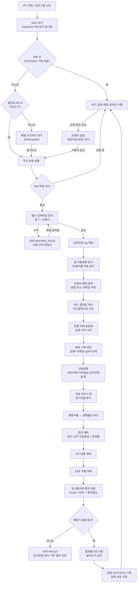
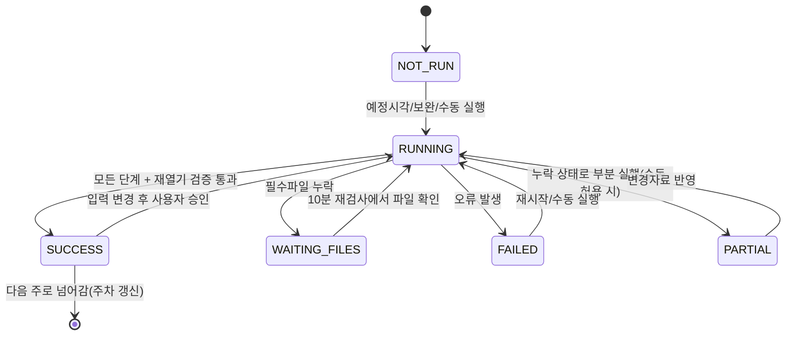

# 자동처리 순서도

## 전체 흐름

## 상태 전이

## 텍스트 요약 (10단계)

1. 시작 60초 대기 → 이번 주 완료 여부 확인 (미완료면 요일 무관 보완 실행)
2. lock으로 동시 실행 방지, 죽은 lock은 자동 복구
3. 팀 7개·은행 3개 필수파일 검사, 누락 시 WAITING_FILES + 10분 재시도
4. 입력자료 zip 백업
5. 팀 지출계획 취합 → 요청ID 기준 최신 선택, 취소·미확정 제외,
   카드 사용일 → 결제일 변환, 대외비는 분류·총액만
6. 은행 3사 거래 표준화 → 중복 제외 → 자동분류 → 이력 누적
7. 지급예정 ↔ 실제출금 대조 (불확실 건은 수동확인필요)
8. 요일별 입금 평균 × 반영률(기본 80%)로 4주 일별·13주 주별 잔액 계산
9. Excel(11개 시트)·PDF·확인필요 파일을 임시폴더에 생성 → 재열기 검증
10. 결과폴더로 이동(덮어쓰기 금지) → SUCCESS 기록 → 변경 감지 대기
