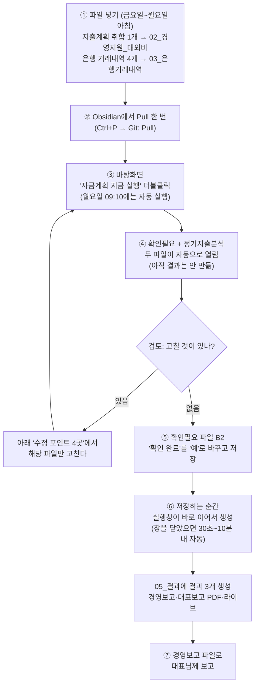

# 자금계획 자동화 — 순서도와 사용방법

> 2026-09-18 기준 최신 기능(경영보고·자동추정 목록·에이팜 별도관리·별칭)까지 반영한 안내서입니다.
> 누구나 이 문서만 보고 따라할 수 있게 만들었습니다.

## 1. 한눈에 보는 순서도

## 2. 매주 하는 일 (따라하기)

| 단계 | 무엇을 | 어떻게 |
|---|---|---|
| ① | 지출계획 넣기 | 각 팀 취합된 **지출계획 파일 1개**를 `02_경영지원_대외비` 폴더에 넣는다 (파일명 자유) |
| ① | 은행파일 넣기 | 농협·우리·국민(2계좌) 거래내역을 `03_은행거래내역`의 **은행별 폴더**에 넣는다 (지난 파일은 자동으로 구파일 폴더로 이동) |
| ② | Pull | Obsidian에서 `Ctrl+P` → `Git: Pull` (프로그램 업데이트를 받는 습관) |
| ③ | 실행 | 바탕화면 **"자금계획 지금 실행"** 더블클릭 |
| ④ | 검토 | 자동으로 열리는 **두 파일**을 살펴본다 (이 단계에서는 결과를 아직 만들지 않음). **확인필요 파일**: '정기지출 누락 의심' 행은 '처리' 열에서 "계획에 반영"/"반영 안 함"을 항목별로 선택 — 일자·금액 칸을 고치면 고친 값으로 들어간다. '계획 없는 실제출금'은 이미 나간 돈의 확인용(조치 불필요). **정기지출분석 파일**: 분류·성격(정기/비정기/제외)을 확인·수정 — 머리글 필터, **N열 분류별 일괄**, **K4 전체 일괄** 지원(넓은 쪽 우선). 고친 값은 이번 결과에 바로 반영. 그 외 고칠 것이 있으면 수정 포인트에서 고치고 다시 실행 |
| ⑤ | 확인 완료 | 검토가 끝나면 확인필요 파일 **B2 '확인 완료'를 '예'**로 바꾸고 저장 |
| ⑥ | 결과 받기 | **저장하는 순간 실행창이 곧바로 이어서** `05_결과`에 **결과 3개**(경영보고·대표보고 PDF·라이브)를 만든다. 실행창을 이미 닫았으면 프로그램이 30초~10분 안에 자동으로 만들고, "지금 실행"을 다시 눌러도 됨 |
| ⑦ | 보고 | **주간자금계획_경영보고** 파일 하나로 대표님 보고 |

## 3. 결과물 — 05_결과에는 이 3개만 남습니다

| 파일 | 용도 |
|---|---|
| **주간자금계획_경영보고** | 대표 보고용. 현재 잔액 → 4주 일별 흐름(부족 여부) → 지출예정 표 → 필요 추가 입금 → 건강사업팀 전달 메모. **노란 칸(반영률·목표잔액·지급일·금액)을 고치면 즉시 재계산**. 두 번째 시트 **'정기지출 체크'**: 금주 도래 정기지출의 팀 제출 누락 의심 표시 |
| 주간자금계획_라이브 | 상세 실무용. 4주일별계획(붉은 상자 = 실행일~차주 금요일), 계좌별시나리오, 13주계획, 에이팜 지출계획, 정기지출분석(맨 끝) |
| 주간자금계획_대표보고 PDF | 인쇄·공유용 요약 (금주 일별 전망 + 80/90/100% 시나리오) |

> 결과물은 **대표이사·관리자 전용**으로, 대외비 포함 모든 지출의 거래처·내용·신청자가 그대로 표시됩니다 (2026-09-19 결정. 다시 가리려면 설정 `mask_confidential: true`).

**검토 단계 파일 2개**는 `06_확인필요` 폴더에 있습니다 — **확인필요 파일**(사람 확인이 필요한 항목: 정기지출 누락 의심·예정지출 미출금 등)과 **정기지출분석 파일**(분류·성격 확인·수정 전용)이 쌍으로 만들어져 함께 열립니다. 두 파일을 검토한 뒤 **확인필요 파일의 B2 '확인 완료'를 '예'**로 저장해야 결과가 만들어집니다. 지난번에 고친 성격·분류가 그대로인지 매주 정기지출분석 파일에서 눈으로 확인하고 진행하면 됩니다.

**성격 3가지의 의미**: **정기** = 평균 금액 자동 추정 대상(자동추정 목록에 등재) / **비정기** = 추정하지 않고 팀 지출예정 파일 금액으로만 반영(단, 금주 '정기지출 체크' 대조는 계속함) / **제외** = 추정도 체크도 하지 않음(완전 제외). 일괄 변경 우선순위는 **K4 전체 일괄 > N열 분류별 일괄 > 개별 행(K열)**.

## 4. 수정 포인트 4곳 — 여기만 고치면 됩니다

| 무엇을 바꾸고 싶나 | 어느 파일 | 어떻게 |
|---|---|---|
| 자동추정 지출의 **일자·금액·반영 여부** | `04_기준파일/자동추정_지출목록.xlsx` | 표에서 일자·금액을 고치거나 **반영 열 드롭다운을 '제외'로** 선택 (회색으로 변함). **한 번에 전부 바꾸려면 안내 시트의 '일괄 설정'**(개별 관리/전체 반영/전체 제외)을 고르면 다음 실행 때 모든 행에 적용. 다음 실행에 반영 |
| 정기지출의 **분류·성격** | **정기지출분석 파일**(확인 단계에 자동으로 열림 — 이번 결과에 바로 반영) 또는 라이브 파일 맨 끝 정기지출분석 시트(다음 실행 때 반영) | 분류 입력, 성격을 드롭다운(정기/비정기/제외)으로 선택. **N열 '분류별 일괄'**로 한 분류 전체를, **K4 '성격 일괄 변경'**으로 전 항목을 한 번에 적용(전체 > 분류별 > 개별 순 우선). 머리글 필터로 골라보기 가능. **비정기·제외 = 자동추정 안 함**(카드대금·외상매입금처럼 금액이 변하는 지출) |
| **에이팜이 내는 지출** 분리 | 지출계획 취합 파일 | 해당 행 **비고란에 "에이팜"** 이라고만 쓰면 자금계획에서 빠지고 라이브의 '에이팜 지출계획' 시트에 모임 |
| 은행 기록명과 취합 표기가 다른 항목 연결 | 자동추정_지출목록의 **별칭 시트** | 예: `NH기업카드 → 농협카드`. 같은 달 취합 입력이 있으면 자동추정이 금액과 무관하게 자동 제외 (카드대금 이중 반영 방지) |
| **공휴일** 등록 (설날·추석·임시공휴일) | 기준파일의 **공휴일 시트** | 일자·이름을 추가하면 결과물의 일자·요일이 주말처럼 **붉은 글자**로 표시. 해마다 채워주세요 (2026년 남은 공휴일은 미리 입력됨) |

## 5. 지금 운영 방식: 정기지출은 팀 지출예정 파일 기준 (2026-09-19~)

1. 자동추정 목록은 현재 **전체 제외** 상태 → 프로그램이 평균 금액을 자금계획에 넣지 않는다
2. 카드대금·보험료·구독료 등 모든 정기지출은 **각 팀 지출예정 파일에 실제 금액으로 입력**되어야 자금계획에 반영된다
3. 그 대신 경영보고의 **'정기지출 체크' 시트**가 금주(실행일~차주 금요일) 도래 정기지출과 팀 제출 내역을 자동 대조한다 → **"누락 의심"**(붉은 행) 항목은 해당 팀에 지출예정 파일 **재제출을 요청**하면 된다 (확인필요 파일에도 같은 내용이 나옴)
4. 자동추정을 다시 쓰고 싶으면 자동추정_지출목록 **안내 시트의 '일괄 설정'**을 '전체 반영'(모두 켜기) 또는 '개별 관리'(행마다 선택)로 바꾼다

## 6. 문제가 생겼을 때

| 증상 | 해결 |
|---|---|
| Obsidian에 **conflict(충돌)** 화면 | 엑셀 창 모두 닫기 → `Ctrl+P` → `Git: Commit all changes` → `Git: Push`. 안 되면 충돌 난 파일을 삭제 후 다시 Commit+Push (자동추정 목록은 다음 실행 때 자동 재생성되어 안전) |
| "라이브 템플릿이 없습니다" | `04_기준파일`에 `자금계획_라이브템플릿.xlsx`가 있는지 확인 |
| 실행했는데 결과 3개가 안 나옴 | 아직 **확인 단계**입니다 — `06_확인필요`의 최신 파일에서 **B2 '확인 완료'를 '예'**로 바꾸고 저장하세요. 실행창이 떠 있으면 몇 초 안에, 닫았으면 30초~10분 안에 자동으로 만들어집니다 (그래도 안 되면 "지금 실행" 다시 클릭). 확인 후 **입력파일을 새로 바꿨다면** 다시 검토 단계부터 시작됩니다 |
| 결과 숫자가 이상함 | `07_실행로그`의 최신 로그 확인 → 그래도 모르면 로그 화면을 캡처해서 문의 |
| 지난 결과·은행파일이 쌓임 | 자동으로 `99_지난자료`로 옮겨지고, **옮겨진 지 14일이 지나면 자동 삭제**되므로 그대로 두면 됨 (보관 기간은 설정 `archive_retention_days`) |

## 7. 자동으로 되는 일 (신경 쓰지 않아도 됨)

- 매주 월요일 09:10 자동 실행 (PC가 꺼져 있었으면 켠 뒤 자동 보완)
- 은행파일 중복 제거·자동 분류, 지난 파일·지난 결과 정리
- 정기지출 새 항목의 자동추정 목록 추가 (사용자가 고친 행은 절대 덮어쓰지 않음)
- 금주 도래 정기지출 ↔ 팀 지출예정 자동 대조 (경영보고 '정기지출 체크' 시트에 누락 의심 표시)
- 결과물 검증 후 저장, 입력자료 백업
