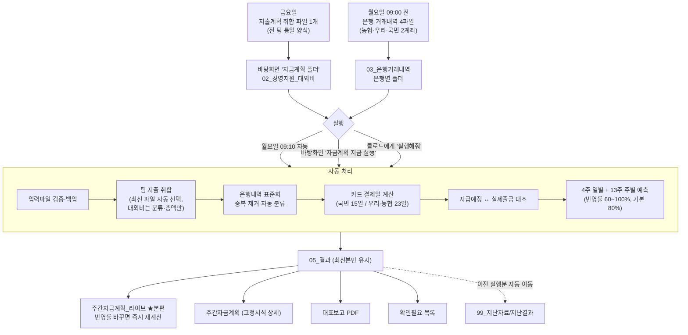

# 자금계획 자동화 — 순서도와 사용방법

> 2026-09-18 기준 최신 동작(통일 취합양식·바탕화면 실행·비고란·결과 자동정리)을 반영한 안내서입니다.

## 1. 전체 순서도



## 2. 매주 하실 일 (딱 2가지)

| 언제 | 무엇을 | 어디에 |
|---|---|---|
| **금요일** | 전 팀 지출계획 취합 파일 1개 | `02_경영지원_대외비` |
| **월요일 09:00 전** | 은행 거래내역 (농협·우리·국민 2계좌) | `03_은행거래내역`의 은행별 폴더 |

- 파일명은 자유. 같은 폴더에 여러 개면 **가장 최근 수정 파일**을 자동 사용.
- 은행 파일은 다운로드 원본(XLS/XLSX/CSV) 그대로. 지난주와 겹쳐도 중복 자동 제거.
- 지출 취합은 `양식\지출계획_취합양식.xlsx` 형태(신청자 열 있음). 이 양식이 들어오면 팀별 개별 파일은 읽지 않으므로 **모든 팀 지출을 한 파일에** 담을 것.

## 3. 실행 방법 3가지

1. **자동**: 월요일 09:10에 알아서 실행 (프로그램 상주 시)
2. **바탕화면 "자금계획 지금 실행"** 더블클릭: 즉시 계산 후 결과 폴더 자동 열림
3. **클로드 채팅**에 "자금계획 실행해줘": 원격 실행 후 파일로 전달

바탕화면 아이콘이 없으면 `cashflow_automation\바탕화면_바로가기_만들기.bat`를 한 번 실행.

## 4. 결과물 4가지 (05_결과)

| 파일 | 용도 |
|---|---|
| **주간자금계획_라이브_….xlsx** | 본편. 요약 시트 **B13 반영률(80%)을 바꾸면 전체 즉시 재계산**. 지출계획_취합 시트, 4주일별계획 비고란(일별 지출 내역) 포함 |
| 주간자금계획_….xlsx | 고정 서식 상세본 (12개 시트: 대조·확인필요·카드기준 등) |
| 주간자금계획_대표보고_….pdf | 대표 보고용 1~2장 요약 |
| 확인필요_….xlsx | 그 주에 검토할 항목 (06_확인필요에도 복사) |

- 05_결과에는 **항상 최신 실행분만** 남습니다. 이전 버전은 삭제되지 않고 `99_지난자료\지난결과`로 이동.

## 5. 처리 규칙 요약

- **반영 정책**: 승인 여부와 관계없이 **전 건을 지급예정일 기준 반영**. 진행상태 "취소"만 제외.
- **카드 결제일**: 국민카드 15일(전월 2일~당월 1일 사용분), 우리·농협카드 23일(전월 10일~당월 9일 사용분). 카드 지출은 결제일에 반영.
- **대외비(경영지원)**: 모든 결과물에서 분류·총액만 표시, 거래처·내용 미노출.
- **비고란(4주일별계획 K열)**: 그날 반영된 팀 지출(거래처·금액)과 자동추정 정기지출 이름이 자동 기록. 매 실행마다 갱신되므로 직접 메모는 다른 열에.
- **급여**: 매월 25일 이후 KB TOP출금은 월말 급여로 분류.
- **온라인 입금 예측**: 최근 12주 요일별 평균 × 반영률.

## 6. 문제가 생기면

| 증상 | 해결 |
|---|---|
| "Python이 설치되어 있지 않습니다" | python.org에서 3.11+ 설치 ("Add python.exe to PATH" 체크) 후 재실행 |
| 패키지 설치 실패 | 인터넷 확인 후 다시 실행하면 이어서 설치됨 |
| 라이브 파일이 안 나옴 | `04_기준파일\자금계획_라이브템플릿.xlsx` 존재 확인 (한 번만 넣으면 됨) |
| 결과가 이상함 | `07_실행로그`의 최신 로그 확인, 또는 실행 창 캡처를 클로드에게 |
| 넣은 파일이 반영 안 됨 | Obsidian 동기화(10분 간격) 대기, 실행 창에 "통일 취합 파일 사용" 문구 확인 |

## 7. 폴더 한눈에 보기

```
자금계획_자동화\
├─ 01_일반팀_지출계획      (구 방식 — 통일 취합 사용 시 미사용)
├─ 02_경영지원_대외비      ★ 지출계획 취합 파일 넣는 곳
├─ 03_은행거래내역          ★ 은행 파일 넣는 곳 (은행별 폴더)
├─ 04_기준파일              라이브템플릿·카드결제기준 (건드리지 않음)
├─ 05_결과                  결과물 4종 (최신본만)
├─ 06_확인필요              확인필요 최신 복사본
├─ 07_실행로그 / 08_백업 / 99_지난자료
└─ 여기에_파일_넣는_방법.md
```
