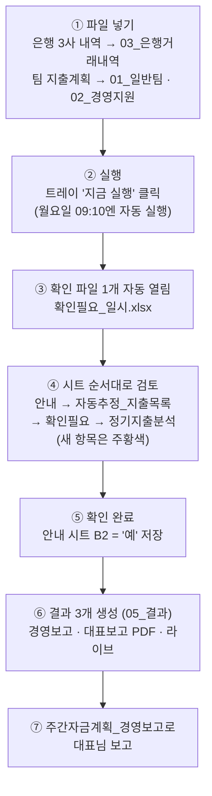

# 자금계획 자동화 — 한눈에 보기 (순서도 · 사용법 · 주의사항)

> 2026-09-20 기준 최신판. 상세 설명은 [[자금계획_자동화_순서도와_사용방법]] 참고.

## ① 한눈에 보는 순서도

- 결과가 나온 뒤 **다시 실행하면 항상 새 확인 단계**부터 시작한다.
- 실행창을 닫고 저장했다면 **"지금 실행"을 한 번 더 클릭 → 기다림 없이 바로 결과**.

## ② 처음부터 사용하는 방법

### 최초 1회 설치
1. `00_프로그램`에서 `build_exe.bat` 실행 → EXE 생성.
2. `install_startup.bat` 실행 → 시작프로그램 등록, 트레이 아이콘 확인.
3. `04_기준파일/에이팜건강_자금계획_기준파일.xlsx`의 **카드결제기준** 시트를 실제 카드 약정(결제일·기산일)에 맞게 확인.
4. Obsidian Git 플러그인이 10분 간격 자동 Pull로 설정돼 있는지 확인.

### 매주 루틴
1. 은행 3사(농협·우리·국민) 거래내역 파일을 내려받아 `03_은행거래내역`에 넣는다.
2. 팀 지출계획 파일을 `01_일반팀_지출계획`·`02_경영지원_대외비`에 넣는다.
3. 트레이에서 **"지금 실행"** 클릭 (또는 월요일 아침 자동 실행을 기다린다).
4. 자동으로 열리는 **확인필요_일시.xlsx**를 시트 순서대로 검토한다.
   - **안내**: 사용 순서 요약 + 새 항목 안내 멘트 + 확인 완료 칸(B2).
   - **자동추정_지출목록**: 자동 추정된 정기지출의 반영/제외. B2에서 일괄 모드(개별 관리/전체 반영/전체 제외) 선택 가능. 여기서 고치면 원본 목록에 자동 반영.
   - **확인필요**: 대조 결과 불확실 건. 처리(I열)에서 선택.
   - **정기지출분석**: 성격(정기/비정기/제외) 관리. 우선순위 = K4 전체 일괄 > N열 분류별 > K열 개별. N열은 현재 상태를 보여주며 **바꾼 분류만** 적용된다.
5. **안내 시트 B2를 '예'로 바꾸고 저장** → 몇 초 안에 결과 3개가 `05_결과`에 생성된다.
6. 결과물 사용:
   - **주간자금계획_경영보고**: 대표 보고용 한 장. 실행일~차주 금요일만 표시(나머지 행 숨김), 노란 칸(반영률·목표잔액·지급일·금액) 고치면 즉시 재계산. '정기지출 체크' 시트에서 팀 제출 누락 의심 확인.
   - **주간자금계획_대표보고 PDF**: 인쇄·공유용 요약.
   - **주간자금계획_라이브**: 실무 상세용. 요약 B13 반영률을 바꾸면 4주일별계획·계좌별시나리오까지 전부 즉시 재계산. 계좌별시나리오는 ①잔액→②입금 배분→③지출→④부족분 이체 블록으로 색 구분.

## ③ 주의사항 — 직접 확인해야 할 것들

### 실행 전
- [ ] Obsidian **Pull이 끝난 뒤** 실행했는가 (프로그램 업데이트 반영).
- [ ] 은행 3사 파일이 **모두 최신**인가 (한 곳이라도 빠지면 실적·잔액이 옛날 기준).
- [ ] 팀 지출계획이 **다 제출**됐는가 (미제출 팀은 실행 로그·확인 파일에 표시).

### 확인 단계에서
- [ ] **주황색(새 항목) 행**은 반드시 눈으로 확인.
- [ ] 정기지출분석 **K4가 '변경 안 함'**인지 (켜져 있으면 L4에 붉은 경고 — 그대로 확인 완료하면 개별·분류별 설정이 전부 덮인다).
- [ ] 성격을 **'제외'로 두면 누락 체크도 안 된다** (현재 광고비 등 28건이 제외 — 알림을 받고 싶으면 '비정기'로).
- [ ] 확인 파일을 **다른 프로그램으로 열어둔 채** 실행하면 잠금 때문에 일부 갱신을 건너뛴다 (경고 로그만 남고 실행은 계속됨).

### 결과 확인 후
- [ ] 경영보고 '정기지출 체크' 시트의 **누락 의심(붉은 행)** → 해당 팀에 재제출 요청.
- [ ] 경영보고 ② 일별 흐름의 **'부족' 표시**와 ④ 필요 추가 입금 확인.
- [ ] 계좌별시나리오의 **'전 계좌 소진' 경고** 확인 (음수 잔액은 붉은 숫자).

### 파일 관리
- `05_결과`엔 최신 실행분만 남고 이전 것은 `99_지난자료/지난결과`로 이동 → **14일 뒤 자동 삭제**, 수동으로 지워도 무방.
- `99_지난자료/지난입력파일`(은행 원본 보관)은 남겨두기를 권장.
- `04_기준파일`·`06_확인필요`·`00_프로그램` 폴더의 파일은 **직접 삭제 금지**.
- 계좌별시나리오 시트는 수식 보호(암호 없음) — 수정할 값은 **요약 시트 B13(반영률)**.

### 자동으로 되는 일 (따로 안 해도 됨)
- 주말·공휴일 날짜 붉은 표시, 정기지출 예정일 주말·공휴일→다음 영업일 이동, 실행일 전의 지난 실적 일자 행 숨김(실행일 행은 항상 표시), PC가 꺼져 있던 주의 보완 실행, 백업(08_백업).
- **실행일 당일은 실적으로 확정하지 않음**: 은행 파일에 당일 새벽 거래가 찍혀 있어도 그날 지급예정(팀 송금 등)은 계획에 그대로 반영되고, 새벽 거래분은 시작 잔액에서 되돌려 이중계산되지 않는다.
