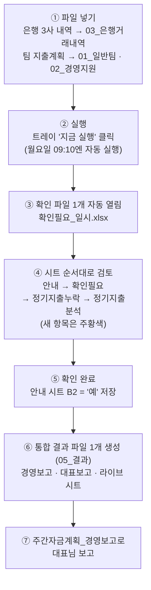

# 자금계획 자동화 — 한눈에 보기 (순서도 · 사용법 · 주의사항)

> 2026-09-23 기준 최신판. 상세 설명은 [[자금계획_자동화_순서도와_사용방법]] 참고.

## ① 한눈에 보는 순서도

- 결과가 나온 뒤 **다시 실행하면 항상 새 확인 단계**부터 시작한다.
- 실행창을 닫고 저장했다면 **"지금 실행"을 한 번 더 클릭 → 기다림 없이 바로 결과**.

## ② 처음부터 사용하는 방법

### 최초 1회 설치
1. `00_프로그램`에서 `build_exe.bat` 실행 → EXE 생성.
2. `install_startup.bat` 실행 → 시작프로그램 등록, 트레이 아이콘 확인.
3. `04_기준파일/에이팜건강_자금계획_기준파일.xlsx`의 **카드결제기준** 시트를 실제 카드 약정(결제일·기산일)에 맞게 확인.
4. Obsidian Git 플러그인이 10분 간격 자동 Pull로 설정돼 있는지 확인.

### 매주 루틴
1. 은행 3사(농협·우리·국민) 거래내역 파일을 내려받아 `03_은행거래내역`에 넣는다. **내려받은 원본 그대로** 넣으면 된다 — 형식·확장자와 무관하게(구형 XLS, XLSX, CSV/TXT, HTML 표 저장본) 내용을 판별해 읽는다. **더존(ERP) 내보내기**(월/일·적요·입금액·출금액·잔액, 연도 없는 날짜)도 해당 은행 폴더에 넣으면 되는데, 안에 계좌번호가 없으니 **파일명에 계좌 뒷자리를 적는다**(예: `국민 4577 20260922.xlsx`) — 은행 원본의 전체 계좌번호와 뒷자리가 맞으면 같은 계좌로 자동으로 묶인다. 잔액 열이 없는 더존 보고서는 넣지 않는다.
2. 팀 지출계획 파일을 `01_일반팀_지출계획`·`02_경영지원_대외비`에 넣는다.
3. 트레이에서 **"지금 실행"** 클릭 (또는 월요일 아침 자동 실행을 기다린다).
4. 자동으로 열리는 **확인필요_일시.xlsx**를 시트 순서대로 검토한다.
   - **안내**: 사용 순서 요약 + 새 항목 안내 멘트 + 확인 완료 칸(B2).
   - **확인필요**: 대조 결과 불확실 건. 처리(I열)에서 선택. **'계획 없는 실제출금'은 처리 열에 분류를 적으면(예: 급여·상여) 기억해서** 다음부터 같은 이름의 거래를 그 분류로 자동 처리하고 다시 묻지 않는다.
   - **정기지출누락**(2026-09-23 신설): 매월 나가던 정기지출인데 이번 팀 지출예정 파일에 없는 항목. **정기지출은 자동으로 계획에 넣지 않으므로**, 나갈 지출이면 처리 열에서 '계획에 반영'을 고르고(일자·금액 수정 가능) 원칙은 팀 재제출 요청.
   - **정기지출분석**: 성격(정기·비정기 = 누락 대조 대상 / 제외 = 대조 안 함) 관리. 우선순위 = K4 전체 일괄 > N열 분류별 > K열 개별. N열은 현재 상태를 보여주며 **바꾼 분류만** 적용된다.
5. **안내 시트 B2를 '예'로 바꾸고 저장** → 몇 초 안에 **통합 결과 파일 1개**(`주간자금계획_일시.xlsx`)가 `05_결과`에 생성된다.
5-1. **금요일 오후(17:00 자동, 또는 트레이 "주간 대조 확인" 클릭)**: 은행 3사 파일을 새로 받아 넣으면 `06_확인필요/주간대조_일시.xlsx`가 생성된다 — 이번 주 **계획 vs 실제 입출금**을 계좌별로 대조해 미집행(주황)·계획없는출금(붉은)·금액차이(노랑)를 보여주니, 차이를 확인하고 B2 '예'로 검토 완료 표시. 미집행 건은 팀 재제출로 관리.
6. 결과물 사용 — **한 파일 안의 시트들**(경영보고·대표보고·요약·4주일별계획·계좌별시나리오·지출계획_취합 등):
   - **경영보고 시트**: 입력 기준 시트. 실행일~차주 금요일만 표시(나머지 행 숨김), 노란 칸(반영률 F12·지급일·금액·목표잔액) 고치면 즉시 재계산. 순서는 **① 현재 자금 현황 → ② 반영된 지출예정 → ③ 반영된 입금예정 → ④ 4주 일별 흐름**(2026-09-23 사용자 요청 — 현황 바로 아래의 ② 표에서 **지급일·금액을 바로 고치면** ④와 라이브 전 시트가 따라옴). ② 표에는 실지출·차이 열이 붙어 **계획과 다른 행(주황)은 확인(I열) 드롭다운으로 체크**하고, ③ 표에서 일별 온라인 예상(반영률 연동)·확정입금과 **실입금(은행 확인)**을 대조한다. 정기지출 관련 시트는 없다(누락 의심은 확인 단계 '정기지출누락' 시트에서).
   - **대표보고 시트**(2026-09-23, PDF 대체): 대표님 보고용 한 장 요약 — 경영보고 수치와 수식으로 연동되고, **그대로 인쇄하면 A4 한 장**에 맞게 나온다.
   - **라이브 시트들(요약·4주일별계획·계좌별시나리오 등)**: 실무 상세용 — **경영보고 ③·④ 표에서 일자·금액을 고치거나 반영률(F12)을 바꾸면 SUMIFS·참조 수식으로 전부 즉시 재계산**된다(반영률 입력은 경영보고 F12 하나, 요약 B13은 참조). 요약 B13 반영률을 바꾸면 4주일별계획·계좌별시나리오까지 전부 즉시 재계산. 계좌별시나리오는 ①잔액→②입금 배분→③지출→④부족분 이체 블록으로 색 구분. 4주일별계획은 **첫 행이 전일 마감 실잔고 출발 행**(계좌별 실잔고를 먼저 확인하고 그 아래로 계획이 이어짐)이고, 열은 일자·요일 → 계좌별 예상잔고 → 온라인 예상입금 → 계좌별 입금 배분 → 확정·기타입금 → 송금예정 순(계좌 열은 그룹으로 접기 가능, 붉은 상자는 행 전체 폭). 지출계획_취합은 경영보고 지출예정 표와 같은 기간(실행일~차주 금요일)만 표시.

## ③ 주의사항 — 직접 확인해야 할 것들

### 실행 전
- [ ] Obsidian **Pull이 끝난 뒤** 실행했는가 (프로그램 업데이트 반영).
- [ ] 은행 3사 파일이 **모두 최신**인가 (한 곳이라도 빠지면 실적·잔액이 옛날 기준).
- [ ] 팀 지출계획이 **다 제출**됐는가 (미제출 팀은 실행 로그·확인 파일에 표시).

### 확인 단계에서
- [ ] **주황색(새 항목) 행**은 반드시 눈으로 확인.
- [ ] 정기지출분석 **K4가 '변경 안 함'**인지 (켜져 있으면 L4에 붉은 경고 — 그대로 확인 완료하면 개별·분류별 설정이 전부 덮인다).
- [ ] 성격을 **'제외'로 두면 누락 체크도 안 된다** (현재 광고비 등 28건이 제외 — 알림을 받고 싶으면 '비정기'로).
- [ ] 확인 파일을 **다른 프로그램으로 열어둔 채** 실행하면 잠금 때문에 일부 갱신을 건너뛴다 (경고 로그만 남고 실행은 계속됨).

### 결과 확인 후
- [ ] 확인 단계 '정기지출누락' 시트의 **누락 의심** → 해당 팀에 재제출 요청 (급하면 '계획에 반영' 선택).
- [ ] 경영보고 ② 일별 흐름의 **'부족' 표시**와 ④ 필요 추가 입금 확인.
- [ ] 계좌별시나리오의 **'전 계좌 소진' 경고** 확인 (음수 잔액은 붉은 숫자).

### 파일 관리
- `05_결과`엔 최신 실행분만 남고 이전 것은 `99_지난자료/지난결과`로 이동 → **14일 뒤 자동 삭제**, 수동으로 지워도 무방.
- `99_지난자료/지난입력파일`(은행 원본 보관)은 남겨두기를 권장.
- `04_기준파일`·`06_확인필요`·`00_프로그램` 폴더의 파일은 **직접 삭제 금지**.
- 계좌별시나리오 시트는 수식 보호(암호 없음) — 수정할 값은 **요약 시트 B13(반영률)**.

### 자동으로 되는 일 (따로 안 해도 됨)
- 주말·공휴일 날짜 붉은 표시, 정기지출 예정일 주말·공휴일→다음 영업일 이동, 실행일 전의 지난 실적 일자 행 숨김(실행일 행은 항상 표시), PC가 꺼져 있던 주의 보완 실행, 백업(08_백업).
- **실행일은 은행 파일 그대로 실적 마감** — 단 **17시 이후 실행이면서 은행 파일에 오늘 거래가 있을 때만**(마감 시각은 config `intraday.close_after`로 변경 가능): 아침·낮 실행은 새 은행 파일에 새벽 입금이 찍혀 있어도 오늘 행이 송금예정·조정 **계획 그대로** 보이고, 17시 이후(하루 마감 후) 실행하면 실적으로 마감된다. 마감되면 실행일 행의 순현금흐름은 실제 입금·출금만이고(송금예정·조정추정 미포함) 기말 = 오늘 실잔고다. 계좌별시나리오의 실행일 행도 계좌별 실잔고 값으로 표시된다. **아직 안 나간 지급예정은 사라지지 않고 익일(다음 영업일)로 이월**되어, 익일 기초 = 오늘 실잔고에서 자금 예산이 시작된다.
- **당일 지출 대조는 확인 단계에서 내가 결정**: 오늘 지출계획과 실제 출금이 다른 항목(미집행·일부지급 등)은 확인필요 파일의 **확인필요 시트에 '당일 지출·실제 차이' 행**으로 올라온다. 처리 열에서 **'지출 예정(유지)'**(기본 — 익일로 이월) 또는 **'보류(제외)'**(이월하지 않고 계획에서 뺌)를 고르고 B2 '예'로 저장하면 결과에 그대로 반영된다.
- **계획에 넣는 것은 세 가지뿐**: 팀 지출예정(취합 파일) · 주간조정(확정입금 등) · 온라인 예상입금(업로드한 계좌 이력 기반 추정). **정기지출 추정은 계획에 넣지 않고** 확인 파일 '정기지출누락' 시트에서 누락만 확인받는다('계획에 반영'을 고른 항목만 들어감).
- **지출예정 파일의 실행일 이전 날짜 항목은 계획에 반영하지 않는다**(2026-09-23) — 자금계획은 항상 실행 기준일부터 진행하고, 지난 예정 중 실제로 안 나간 건은 확인필요의 '예정지출 미출금'으로만 알려준다. 계좌별 **최종 실잔고에서 출발**해 예상입금(온라인 요일평균×반영률+확정입금)을 반영하는 방식은 그대로다.
